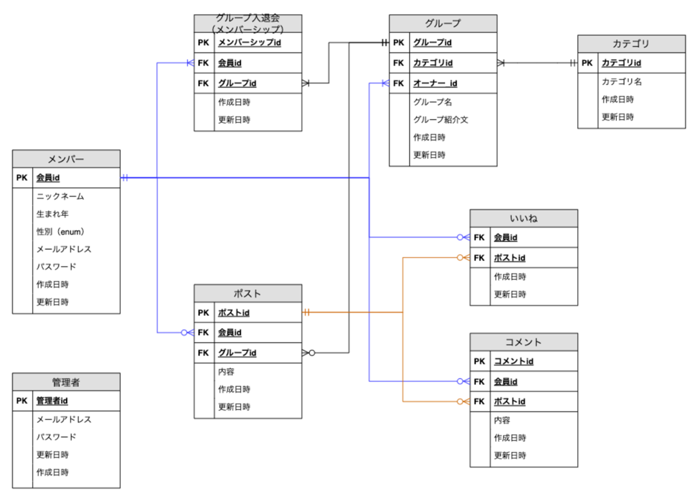
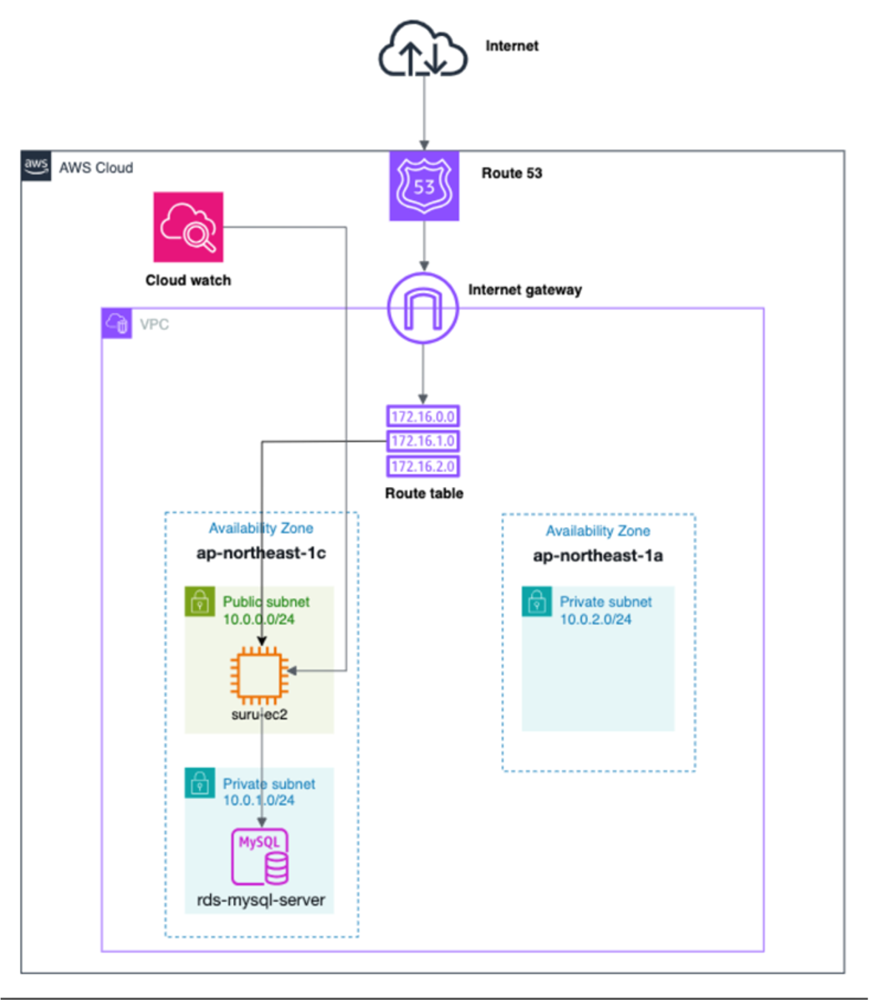

# SuRu
## サイト概要
### サイトテーマ
美容と健康、ゆるく繋がって、続けるためのコミュニティサイト

### URL
(https://suru-community.com)

### テーマを選んだ理由
もともと健康や美容に興味があり、毎日ストレッチをする、ジムに通う、食事制限をするなど、自分なりにルールを決めて継続していました。
しかし、1人で続けるのは思った以上に難しく、モチベーションが下がることもありました。
学生時代にアルバイトをしていたジムでは会員さんと会話する機会が多く、「1人だとつい怠けてしまうけど、誰かに励まされたり、人の目があると頑張れる」という声を聞きました。
この経験から、リアルじゃなくても、アプリ上で気軽に励まし合えるサービスがあれば便利だと考えるようになりました。
また、「リアルで人に会うのが苦手」「誰かに直接声をかけるのはハードルが高い」という人でも、同じ目標を持つ仲間とグループでゆるく頑張りを共有できる仕組みなら、無理なく続けられるのではないかと考え、このテーマを選びました。

### ターゲットユーザ
- 美容・継続管理アプリを入れてるけど、続かない人
- 仕事終わりにジムに行こうと思ってるけど、1人だとついサボってしまう人
- 何か継続したい気持ちはあるけど、きっかけや仲間がほしい人
- 大勢ではなく、気軽に少人数の仲間と励まし合いたい人
- リアルで会うのはハードル高いけど、オンラインで気軽にゆるく繋がれるとうれしい人
- 一緒に頑張っている人に励まされると、モチベーションがアップする人
​
### 主な利用シーン
- 何か継続して行いたいと思っているけど、何をしようか迷っている時
- 一緒に継続することを頑張っている人を探したい時
- 継続しようと頑張っている仲間を見て、自分もやる気を出したい時
- サボりそうになった時、仲間から励ましてもらいたい時

## 設計書
- ER図

- UI Flows[(リンク)](https://docs.google.com/spreadsheets/d/1iNE5O0pF0a7ndI48kSybQE_YSv32P5vREa2o03fOozk/edit?usp=drive_link)
- テーブル定義書[(リンク)](https://docs.google.com/spreadsheets/d/1NE0FUC1XkZhQnUSlpCnsnP0iomoIsRFS0N7GKi6gf7U/edit?usp=drive_link)
- アプリケーション詳細設計書[(リンク)](https://drive.google.com/file/d/1azhFtkB7Izum6y55pyQ6YRJi79s3RNav/view?usp=drive_link)

## 開発環境
- OS：Linux(CentOS)
- アプリケーションサーバー：Puma
- Webサーバー：Nginx
- 言語：HTML,CSS,JavaScript,Ruby
- フレームワーク：Ruby on Rails
- JSライブラリ：jQuery
- 認証機能：Devise
- テスト：RSpec（FactoryBot / Faker）
- データベース：MySQL
- バージョン管理：Git / GitHub
- デプロイ：AWS（EC2）

## AWS構成図

​
## 使用素材
- Canva（URL:https://www.canva.com/）によるAI生成画像を使用